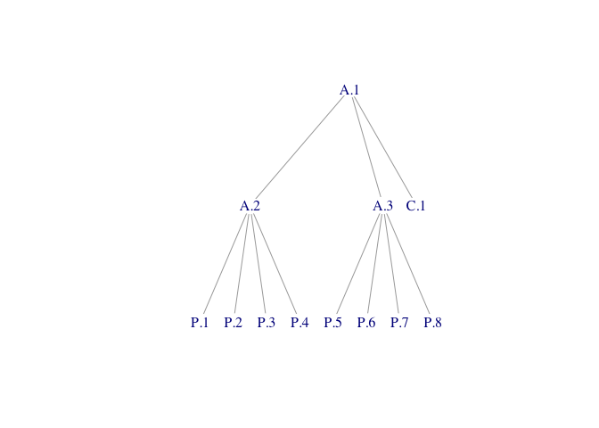

<!-- README.md is generated from README.Rmd. Please edit that file -->

# massProps

<!-- badges: start -->

<!-- badges: end -->

The `massProps` package extends `rollupTree` with functions to
recursively calculate mass properties (and optionally, their
uncertainties) for arbitrary composition trees. Formulas implemented are
described in a technical paper published by the Society of Allied Weight
Engineers (Zimmerman and Nakai 2005).

## Installation

``` r
install.packages("massProps")
```

You can install the development version of massProps from
[GitHub](https://github.com/) with:

``` r
# install.packages("pak")
pak::pak("jsjuni/massProps")
```

## Example

Suppose we have the following mass properties table:

``` r
library(massProps)
test_table
#>     id parent mass Cx Cy Cz Ixx  Ixy   Ixz Iyy   Iyz Izz POIconv Ipoint
#> 1  A.1          NA NA NA NA  NA   NA    NA  NA    NA  NA       -  FALSE
#> 2  A.2    A.1   NA NA NA NA  NA   NA    NA  NA    NA  NA       -  FALSE
#> 3  A.3    A.1   NA NA NA NA  NA   NA    NA  NA    NA  NA       -  FALSE
#> 4  C.1    A.1    5  0  0  0  80 -4.0 -24.0  80 -24.0  75       -  FALSE
#> 5  P.1    A.2    2  1  1  1   4 -0.1  -0.1   4   0.1   4       -  FALSE
#> 6  P.2    A.2    2  1  1 -1   4 -0.1  -0.1   4   0.1   4       -  FALSE
#> 7  P.3    A.2    2  1 -1  1   4 -0.1  -0.1   4   0.1   4       -  FALSE
#> 8  P.4    A.2    2  1 -1 -1   4 -0.1  -0.1   4   0.1   4       -  FALSE
#> 9  P.5    A.3    2 -1  1  1   4 -0.1  -0.1   4   0.1   4       -  FALSE
#> 10 P.6    A.3    2 -1  1 -1   4 -0.1  -0.1   4   0.1   4       -  FALSE
#> 11 P.7    A.3    2 -1 -1  1   4 -0.1  -0.1   4   0.1   4       -  FALSE
#> 12 P.8    A.3    2 -1 -1 -1   4 -0.1  -0.1   4   0.1   4       -  FALSE
```

`POIconv` indicates the products of inertia sign convention. In the
negative convention, for example, $I_{XY} \equiv -\int{xy \rho \, dV}$.
In the positive convention, $I_{XY} \equiv \int{xy \rho \, dV}$.

`Ipoint` indicates whether this object is to be considered a point mass.
The same algebraic result can be achieved by setting all moments and
products of inertia to zero, but `rollup_mass_props()` by default
ensures that all leaf items in the tree have mass properties that
correspond to physically-realizable objects. A zero inertia tensor will
fail this check. Rather than relax the check (which is essential for
trustworthy results), a `TRUE` value for `Ipoint` indicates that the
inertia tensor should be excluded from computations.

We construct a graph with edges representing child-parent relations:

``` r
library(igraph)
E(test_tree)
#> + 11/11 edges from 7d8200c (vertex names):
#>  [1] A.2->A.1 A.3->A.1 C.1->A.1 P.1->A.2 P.2->A.2 P.3->A.2 P.4->A.2 P.5->A.3
#>  [9] P.6->A.3 P.7->A.3 P.8->A.3
```



We can roll up mass properties to non-leaf elements as follows:

``` r
rollup_mass_props(test_tree, test_table)
#>     id parent mass Cx Cy Cz Ixx  Ixy   Ixz Iyy   Iyz Izz POIconv Ipoint
#> 1  A.1          21  0  0  0 144 -4.8 -24.8 144 -23.2 139       -  FALSE
#> 2  A.2    A.1    8  1  0  0  32 -0.4  -0.4  24   0.4  24       -  FALSE
#> 3  A.3    A.1    8 -1  0  0  32 -0.4  -0.4  24   0.4  24       -  FALSE
#> 4  C.1    A.1    5  0  0  0  80 -4.0 -24.0  80 -24.0  75       -  FALSE
#> 5  P.1    A.2    2  1  1  1   4 -0.1  -0.1   4   0.1   4       -  FALSE
#> 6  P.2    A.2    2  1  1 -1   4 -0.1  -0.1   4   0.1   4       -  FALSE
#> 7  P.3    A.2    2  1 -1  1   4 -0.1  -0.1   4   0.1   4       -  FALSE
#> 8  P.4    A.2    2  1 -1 -1   4 -0.1  -0.1   4   0.1   4       -  FALSE
#> 9  P.5    A.3    2 -1  1  1   4 -0.1  -0.1   4   0.1   4       -  FALSE
#> 10 P.6    A.3    2 -1  1 -1   4 -0.1  -0.1   4   0.1   4       -  FALSE
#> 11 P.7    A.3    2 -1 -1  1   4 -0.1  -0.1   4   0.1   4       -  FALSE
#> 12 P.8    A.3    2 -1 -1 -1   4 -0.1  -0.1   4   0.1   4       -  FALSE
```

Note that, although the table shows the parent of each element for
clarity of exposition, the child-parent relations are coneveyed *only*
by the tree passed as the first argument.

The input data may include mass properties uncertainties as well:

``` r
test_unc_table
#>     id parent mass Cx Cy Cz Ixx  Ixy   Ixz Iyy   Iyz Izz POIconv Ipoint
#> 1  A.1          NA NA NA NA  NA   NA    NA  NA    NA  NA       -  FALSE
#> 2  A.2    A.1   NA NA NA NA  NA   NA    NA  NA    NA  NA       -  FALSE
#> 3  A.3    A.1   NA NA NA NA  NA   NA    NA  NA    NA  NA       -  FALSE
#> 4  C.1    A.1    5  0  0  0  80 -4.0 -24.0  80 -24.0  75       -  FALSE
#> 5  P.1    A.2    2  1  1  1   4 -0.1  -0.1   4   0.1   4       -  FALSE
#> 6  P.2    A.2    2  1  1 -1   4 -0.1  -0.1   4   0.1   4       -  FALSE
#> 7  P.3    A.2    2  1 -1  1   4 -0.1  -0.1   4   0.1   4       -  FALSE
#> 8  P.4    A.2    2  1 -1 -1   4 -0.1  -0.1   4   0.1   4       -  FALSE
#> 9  P.5    A.3    2 -1  1  1   4 -0.1  -0.1   4   0.1   4       -  FALSE
#> 10 P.6    A.3    2 -1  1 -1   4 -0.1  -0.1   4   0.1   4       -  FALSE
#> 11 P.7    A.3    2 -1 -1  1   4 -0.1  -0.1   4   0.1   4       -  FALSE
#> 12 P.8    A.3    2 -1 -1 -1   4 -0.1  -0.1   4   0.1   4       -  FALSE
#>    sigma_mass sigma_Cx sigma_Cy sigma_Cz sigma_Ixx sigma_Iyy sigma_Izz
#> 1          NA       NA       NA       NA        NA        NA        NA
#> 2          NA       NA       NA       NA        NA        NA        NA
#> 3          NA       NA       NA       NA        NA        NA        NA
#> 4         0.5      0.0      0.0      0.0       8.0       8.0       7.5
#> 5         0.2      0.1      0.1      0.1       0.4       0.4       0.4
#> 6         0.2      0.1      0.1      0.1       0.4       0.4       0.4
#> 7         0.2      0.1      0.1      0.1       0.4       0.4       0.4
#> 8         0.2      0.1      0.1      0.1       0.4       0.4       0.4
#> 9         0.2      0.1      0.1      0.1       0.4       0.4       0.4
#> 10        0.2      0.1      0.1      0.1       0.4       0.4       0.4
#> 11        0.2      0.1      0.1      0.1       0.4       0.4       0.4
#> 12        0.2      0.1      0.1      0.1       0.4       0.4       0.4
#>    sigma_Ixy sigma_Ixz sigma_Iyz
#> 1         NA        NA        NA
#> 2         NA        NA        NA
#> 3         NA        NA        NA
#> 4       0.40      2.40      2.40
#> 5       0.01      0.01      0.01
#> 6       0.01      0.01      0.01
#> 7       0.01      0.01      0.01
#> 8       0.01      0.01      0.01
#> 9       0.01      0.01      0.01
#> 10      0.01      0.01      0.01
#> 11      0.01      0.01      0.01
#> 12      0.01      0.01      0.01
```

Mass properties and their uncertainties can be rolled up as follows:

``` r
rollup_mass_props_and_unc(test_tree, test_unc_table)
#>     id parent mass Cx Cy Cz Ixx  Ixy   Ixz Iyy   Iyz Izz POIconv Ipoint
#> 1  A.1          21  0  0  0 144 -4.8 -24.8 144 -23.2 139       -  FALSE
#> 2  A.2    A.1    8  1  0  0  32 -0.4  -0.4  24   0.4  24       -  FALSE
#> 3  A.3    A.1    8 -1  0  0  32 -0.4  -0.4  24   0.4  24       -  FALSE
#> 4  C.1    A.1    5  0  0  0  80 -4.0 -24.0  80 -24.0  75       -  FALSE
#> 5  P.1    A.2    2  1  1  1   4 -0.1  -0.1   4   0.1   4       -  FALSE
#> 6  P.2    A.2    2  1  1 -1   4 -0.1  -0.1   4   0.1   4       -  FALSE
#> 7  P.3    A.2    2  1 -1  1   4 -0.1  -0.1   4   0.1   4       -  FALSE
#> 8  P.4    A.2    2  1 -1 -1   4 -0.1  -0.1   4   0.1   4       -  FALSE
#> 9  P.5    A.3    2 -1  1  1   4 -0.1  -0.1   4   0.1   4       -  FALSE
#> 10 P.6    A.3    2 -1  1 -1   4 -0.1  -0.1   4   0.1   4       -  FALSE
#> 11 P.7    A.3    2 -1 -1  1   4 -0.1  -0.1   4   0.1   4       -  FALSE
#> 12 P.8    A.3    2 -1 -1 -1   4 -0.1  -0.1   4   0.1   4       -  FALSE
#>    sigma_mass   sigma_Cx   sigma_Cy   sigma_Cz sigma_Ixx sigma_Iyy sigma_Izz
#> 1   0.7549834 0.03809524 0.03809524 0.03809524  8.313844  8.275264  7.792946
#> 2   0.4000000 0.05000000 0.07071068 0.07071068  1.600000  1.200000  1.200000
#> 3   0.4000000 0.05000000 0.07071068 0.07071068  1.600000  1.200000  1.200000
#> 4   0.5000000 0.00000000 0.00000000 0.00000000  8.000000  8.000000  7.500000
#> 5   0.2000000 0.10000000 0.10000000 0.10000000  0.400000  0.400000  0.400000
#> 6   0.2000000 0.10000000 0.10000000 0.10000000  0.400000  0.400000  0.400000
#> 7   0.2000000 0.10000000 0.10000000 0.10000000  0.400000  0.400000  0.400000
#> 8   0.2000000 0.10000000 0.10000000 0.10000000  0.400000  0.400000  0.400000
#> 9   0.2000000 0.10000000 0.10000000 0.10000000  0.400000  0.400000  0.400000
#> 10  0.2000000 0.10000000 0.10000000 0.10000000  0.400000  0.400000  0.400000
#> 11  0.2000000 0.10000000 0.10000000 0.10000000  0.400000  0.400000  0.400000
#> 12  0.2000000 0.10000000 0.10000000 0.10000000  0.400000  0.400000  0.400000
#>    sigma_Ixy sigma_Ixz sigma_Iyz
#> 1  1.0586784 2.5924506 2.5924506
#> 2  0.4004997 0.4004997 0.6931089
#> 3  0.4004997 0.4004997 0.6931089
#> 4  0.4000000 2.4000000 2.4000000
#> 5  0.0100000 0.0100000 0.0100000
#> 6  0.0100000 0.0100000 0.0100000
#> 7  0.0100000 0.0100000 0.0100000
#> 8  0.0100000 0.0100000 0.0100000
#> 9  0.0100000 0.0100000 0.0100000
#> 10 0.0100000 0.0100000 0.0100000
#> 11 0.0100000 0.0100000 0.0100000
#> 12 0.0100000 0.0100000 0.0100000
```

## References

<div id="refs" class="references csl-bib-body hanging-indent"
entry-spacing="0">

<div id="ref-zimmerman:05:sawe" class="csl-entry">

Zimmerman, Robert L., and John H. Nakai. 2005. “Are You Sure?
Uncertainty in Mass Properties Engineering.” In *64th Annual
International Conference on Mass Properties Engineering*, 123–60.
Society of Allied Weight Engineers.

</div>

</div>
