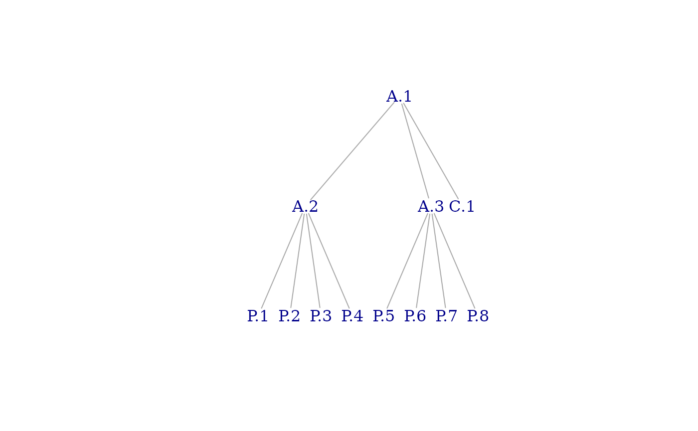

# massProps

## Overview

The `massProps` package extends `rollupTree` with functions to
recursively calculate mass properties (and optionally, their
uncertainties) for arbitrary decomposition trees. Formulas implemented
are described in a technical paper published by the Society of Allied
Weight Engineers (Zimmerman and Nakai 2005).

## Synopsis

### Data Structures

`massProps` operates on two fundamental data structures: a mass
properties table and a tree. The mass properties table has an entry for
every item in a tree structure of items; the edges of the tree convey
the parent-child relations among items. The two data structures are
linked by the `id` column of the data frame, which must be a character
vector of unique item identifiers, and the vertex names of the tree. The
sets of identifiers must be identical.

#### Mass Property Table

##### Required Columns for Mass Properties

The Mass Property Table must contain the following columns. Other
columns may exist and will remain unmodified.

- `id` unique identifier for each item (row)

- `mass` mass of the item (numeric)

- `Cx` $x$-component of center of mass (numeric)

- `Cy` $y$-component of center of mass (numeric)

- `Cx` $z$-component of center of mass (numeric)

- `Ixx` moment of inertia about the $x$ axis (numeric)

- `Iyy` moment of inertia about the $y$ axis (numeric)

- `Izz` moment of inertia about the $z$ axis (numeric)

- `Ixy` product of inertia relative to the $x$ and $y$ axes (numeric)

- `Ixz` product of inertia relative to the $x$ and $z$ axes (numeric)

- `Iyz` product of inertia relative to the $y$ and $z$ axes (numeric)

- `POIconv` either ‘+’ or ‘-’, indicating the sign convention for
  products of inertia. In the negative convention, for example,
  $I_{XY} \equiv - \int{xy\rho\, dV}$. In the positive convention,
  $I_{XY} \equiv \int{xy\rho\, dV}$.

- `Ipoint` logical indicator that this item is considered a point mass.
  The same algebraic result can be achieved by setting all moments and
  products of inertia to zero, but
  [`rollup_mass_props()`](https://jsjuni.github.io/massProps/reference/rollup_mass_props.md)
  by default ensures that all leaf items in the tree have mass
  properties that correspond to physically-realizable objects. A zero
  inertia tensor will fail this check. Rather than relax the check
  (which is essential for trustworthy results), a `TRUE` value for
  `Ipoint` indicates that the inertia tensor should be excluded from
  computations.

##### Required Columns for Mass Properties Uncertainties

The following columns are required for uncertainty calculations:

- `sigma_mass` mass uncertainty (numeric)

- `sigma_Cx` $x$-component of center of mass uncertainty (numeric)

- `sigma_Cy` $y$-component of center of mass uncertainty (numeric)

- `sigma_Cx` $z$-component of center of mass uncertainty (numeric)

- `sigma_Ixx` moment of inertia about the $x$ axis uncertainty (numeric)

- `sigma_Iyy` moment of inertia about the $y$ axis uncertainty (numeric)

- `sigma_Izz` moment of inertia about the $z$ axis uncertainty (numeric)

- `sigma_Ixy` product of inertia relative to the $x$ and $y$ axes
  uncertainty (numeric)

- `sigma_Ixz` product of inertia relative to the $x$ and $z$ axes
  uncertainty (numeric)

- `sigma_Iyz` product of inertia relative to the $y$ and $z$ axes
  uncertainty (numeric)

It is the caller’s responsibility to ensure that all values are
expressed in appropriate and compatible units.

##### Tree

The tree is an
[`igraph::graph`](https://r.igraph.org/reference/graph.html) with
vertices named by identifiers in the mass properties table. It can be of
arbitrary depth and shape as long as it satisfies certain
well-formedness properties:

- it is connected and acyclic (as an undirected graph), i.e., it is a
  tree

- it is directed, with edge direction going from child to parent

- it contains neither loops (self-edges) nor multiple edges

- it contains a single root vertex (i.e., one whose out degree is zero)

### Invocation

``` r
library(massProps)
```

Suppose we have the following mass properties table:

``` r
test_table
#>     id parent mass Cx Cy Cz Ixx  Ixy   Ixz Iyy   Iyz Izz POIconv Ipoint
#> 1  A.1          NA NA NA NA  NA   NA    NA  NA    NA  NA       -  FALSE
#> 2  A.2    A.1   NA NA NA NA  NA   NA    NA  NA    NA  NA       -  FALSE
#> 3  A.3    A.1   NA NA NA NA  NA   NA    NA  NA    NA  NA       -  FALSE
#> 4  C.1    A.1    5  0  0  0  80 -4.0 -24.0  80 -24.0  75       -  FALSE
#> 5  P.1    A.2    2  1  1  1   4 -0.1  -0.1   4   0.1   4       -  FALSE
#> 6  P.2    A.2    2  1  1 -1   4 -0.1  -0.1   4   0.1   4       -  FALSE
#> 7  P.3    A.2    2  1 -1  1   4 -0.1  -0.1   4   0.1   4       -  FALSE
#> 8  P.4    A.2    2  1 -1 -1   4 -0.1  -0.1   4   0.1   4       -  FALSE
#> 9  P.5    A.3    2 -1  1  1   4 -0.1  -0.1   4   0.1   4       -  FALSE
#> 10 P.6    A.3    2 -1  1 -1   4 -0.1  -0.1   4   0.1   4       -  FALSE
#> 11 P.7    A.3    2 -1 -1  1   4 -0.1  -0.1   4   0.1   4       -  FALSE
#> 12 P.8    A.3    2 -1 -1 -1   4 -0.1  -0.1   4   0.1   4       -  FALSE
```

Suppose we also have this tree:

``` r
library(igraph)
test_tree
#> IGRAPH 7d8200c DN-- 12 11 -- 
#> + attr: name (v/c)
#> + edges from 7d8200c (vertex names):
#>  [1] A.2->A.1 A.3->A.1 C.1->A.1 P.1->A.2 P.2->A.2 P.3->A.2 P.4->A.2 P.5->A.3
#>  [9] P.6->A.3 P.7->A.3 P.8->A.3
```



Then we can compute mass properties for non-leaf elements by calling
[`rollup_mass_props()`](https://jsjuni.github.io/massProps/reference/rollup_mass_props.md):

``` r
rollup_mass_props(test_tree, test_table)
#>     id parent mass Cx Cy Cz Ixx  Ixy   Ixz Iyy   Iyz Izz POIconv Ipoint
#> 1  A.1          21  0  0  0 144 -4.8 -24.8 144 -23.2 139       -  FALSE
#> 2  A.2    A.1    8  1  0  0  32 -0.4  -0.4  24   0.4  24       -  FALSE
#> 3  A.3    A.1    8 -1  0  0  32 -0.4  -0.4  24   0.4  24       -  FALSE
#> 4  C.1    A.1    5  0  0  0  80 -4.0 -24.0  80 -24.0  75       -  FALSE
#> 5  P.1    A.2    2  1  1  1   4 -0.1  -0.1   4   0.1   4       -  FALSE
#> 6  P.2    A.2    2  1  1 -1   4 -0.1  -0.1   4   0.1   4       -  FALSE
#> 7  P.3    A.2    2  1 -1  1   4 -0.1  -0.1   4   0.1   4       -  FALSE
#> 8  P.4    A.2    2  1 -1 -1   4 -0.1  -0.1   4   0.1   4       -  FALSE
#> 9  P.5    A.3    2 -1  1  1   4 -0.1  -0.1   4   0.1   4       -  FALSE
#> 10 P.6    A.3    2 -1  1 -1   4 -0.1  -0.1   4   0.1   4       -  FALSE
#> 11 P.7    A.3    2 -1 -1  1   4 -0.1  -0.1   4   0.1   4       -  FALSE
#> 12 P.8    A.3    2 -1 -1 -1   4 -0.1  -0.1   4   0.1   4       -  FALSE
```

Note that, although the table shows the parent of each element for
clarity of exposition, the child-parent relations are coneveyed *only*
by the tree passed as the first argument.

The input may also contain uncertainties data. This example is from the
Society of Allied Weight Engineers:

``` r
sawe_input
#>         id  mass    Cx    Cy    Cz     Ixx     Iyy      Izz    Ixy      Ixz
#> 1   Widget 57.83 121.2  0.04 -0.16 7258.90 8607.02 10453.40 834.44 -1198.38
#> 2 2nd Part 16.80  70.9 -0.95  0.46   65.07 1124.65  1078.82  76.01   202.83
#> 3 Combined    NA    NA    NA    NA      NA      NA       NA     NA       NA
#>        Iyz sigma_mass sigma_Cx sigma_Cy sigma_Cz sigma_Ixx sigma_Iyy sigma_Izz
#> 1 -1066.58     1.2416   0.2764   0.2085   0.0669  386.9233  171.4792  414.5547
#> 2    13.62     1.7308   0.6234   0.5173   0.1405   12.4687  109.1324  108.5481
#> 3       NA         NA       NA       NA       NA        NA        NA        NA
#>   sigma_Ixy sigma_Ixz sigma_Iyz Ipoint POIconv
#> 1 1440.5402  344.6237  124.6860  FALSE       +
#> 2   55.8879  212.1241   11.5408  FALSE       +
#> 3        NA        NA        NA  FALSE       +
```

``` r
rollup_mass_props_and_unc(sawe_tree, sawe_input)
#>         id  mass       Cx         Cy          Cz      Ixx      Iyy      Izz
#> 1   Widget 57.83 121.2000  0.0400000 -0.16000000 7258.900  8607.02 10453.40
#> 2 2nd Part 16.80  70.9000 -0.9500000  0.46000000   65.070  1124.65  1078.82
#> 3 Combined 74.63 109.8769 -0.1828594 -0.02043146 7341.733 42673.75 44482.05
#>        Ixy       Ixz       Iyz sigma_mass sigma_Cx  sigma_Cy   sigma_Cz
#> 1  834.440 -1198.380 -1066.580    1.24160  0.27640 0.2085000 0.06690000
#> 2   76.010   202.830    13.620    1.73080  0.62340 0.5173000 0.14050000
#> 3 1558.714 -1401.534 -1060.951    2.13008  0.95821 0.1999847 0.06178402
#>   sigma_Ixx sigma_Iyy sigma_Izz sigma_Ixy sigma_Ixz sigma_Iyz Ipoint POIconv
#> 1  386.9233  171.4792  414.5547 1440.5402  344.6237  124.6860  FALSE       +
#> 2   12.4687  109.1324  108.5481   55.8879  212.1241   11.5408  FALSE       +
#> 3  387.4017 2789.3133 2815.3260 1488.0948  418.6048  125.3175  FALSE       +
```

## Objectives and Strategy

The objective of this package is to provide a trustworthy,
well-documented, reference implementation for computation of mass
properties (and their uncertainties) of aggregate objects from those of
their parts. Aggregation can be recursive (e.g., indentured Bill of
Materials), so it must accommodate trees of arbitrary depth and shape.

Strategies for achieving the objective include

- basing the calculations on published industry references,

- re-casting those lengthy reference equations into concise vector or
  matrix forms to reduce the error surface for source code and exploit
  the capabilities of `R`, which treats vectors and matrices as
  first-class objects,

- delegating orchestration to the `rollupTree` package, which, among
  other things, verifies that the input tree is well-formed and ensures
  proper ordering of computations,

- ensuring that all asserted leaf mass properties and uncertainties
  correspond to physically-realizable objects,

- coding in pure functional style, (i.e., avoiding mutable variables,
  implying iteration with [`Map()`](https://rdrr.io/r/base/funprog.html)
  and [`Reduce()`](https://rdrr.io/r/base/funprog.html)), and

- covering the entire code base with unit tests.

The author has intentionally made no effort to micro-optimize for
performance. In particular, the author is aware that representing the
inertia and its uncertainty as 3 ⨉ 3 matrices is “inefficient” to the
degree that it independently calculates values that are redundant by
symmetry. “Inefficient”, however, does not mean “slow”. See [Performance
Evaluation](#performance-evaluation) below.

## Theory

In this section, we state the reference equations (Zimmerman and Nakai
2005) and show, where applicable, how those equations can be rewritten
in more concise form. The form of the equations actually implemented is
displayed within a box, e.g. $\boxed{F = ma}$.

The reference uses the word *weight* and the symbol $w$ in equations. We
interpret weight as mass. The reference refers to center of mass by its
$x$, $y$, and $z$ components. Symbols for moments ($I_{XX}$) and
products ($I_{XY}$) of inertia are conventional. Variables with $i$
subscripts designate properties of parts; those without designate
properties of aggregates. The letter $\sigma$ denotes uncertainty.
$\sigma_{w}$, for example, is the mass uncertainty.

### Mass Properties

#### Mass

The mass equation is suitable as is.

$$\boxed{w = \sum\limits_{i = 1}^{n}w_{i}}$$

The corresponding `R` code is

``` r
  amp$mass <- Reduce(`+`, Map(f = function(mp) mp$mass, mpl))
```

In this and the following code snippets, the variable `mpl` is a list of
input mass property sets for parts, the variable `mp` is a formal
parameter of an anonymous function applied to each member of `mpl`, and
`amp` is the resulting aggregate mass property set. The line above is an
`R` functional programming idiom for “set the mass value of the
aggregate to the sum of the mass values of the parts”.

#### Center of Mass

$$\begin{aligned}
\bar{x} & {= \sum\limits_{i = 1}^{n}w_{i}x_{i}/\sum\limits_{i = 1}^{n}w_{i}} \\
\bar{y} & {= \sum\limits_{i = 1}^{n}w_{i}y_{i}/\sum\limits_{i = 1}^{n}w_{i}} \\
\bar{z} & {= \sum\limits_{i = 1}^{n}w_{i}z_{i}/\sum\limits_{i = 1}^{n}w_{i}} \\
 & 
\end{aligned}$$

We can express center of mass as a 3-vector:

$$\boxed{\begin{aligned}
\mathbf{c}_{i} & {= \left( x_{i}\quad y_{i}\quad z_{i} \right)^{T}} \\
\bar{\mathbf{c}} & {= \left( \bar{x}\quad\bar{y}\quad\bar{z} \right)^{T}}
\end{aligned}}$$

Then

$$\boxed{\bar{\mathbf{c}} = \frac{1}{w}\sum\limits_{i = 1}^{n}w_{i}\mathbf{c}_{i}}$$

The corresponding `R` code is

``` r
  amp$center_mass <- Reduce(`+`, Map(f = function(mp) mp$mass * mp$center_mass, mpl)) / amp$mass
```

#### Inertia Tensor

##### Moments of Inertia

$$\begin{array}{rlr}
I_{XX} & {= \sum\limits_{i = 1}^{n}\left\lbrack {I_{XX}}_{i} + w_{i}\left( y_{i}^{2} + z_{i}^{2} \right) - w_{i}\left( {\bar{y}}^{2} + {\bar{z}}^{2} \right) \right\rbrack} & {= \sum\limits_{i = 1}^{n}\left\{ {I_{XX}}_{i} + w_{i}\left\lbrack \left( y_{i} - \bar{y} \right)^{2} + \left( z_{i} - \bar{z} \right)^{2} \right\rbrack \right\}} \\
I_{YY} & {= \sum\limits_{i = 1}^{n}\left\lbrack {I_{YY}}_{i} + w_{i}\left( x_{i}^{2} + z_{i}^{2} \right) - w_{i}\left( {\bar{x}}^{2} + {\bar{z}}^{2} \right) \right\rbrack} & {= \sum\limits_{i = 1}^{n}\left\{ {I_{YY}}_{i} + w_{i}\left\lbrack \left( x_{i} - \bar{x} \right)^{2} + \left( z_{i} - \bar{z} \right)^{2} \right\rbrack \right\}} \\
I_{ZZ} & {= \sum\limits_{i = 1}^{n}\left\lbrack {I_{ZZ}}_{i} + w_{i}\left( x_{i}^{2} + y_{i}^{2} \right) - w_{i}\left( {\bar{x}}^{2} + {\bar{y}}^{2} \right) \right\rbrack} & {= \sum\limits_{i = 1}^{n}\left\{ {I_{ZZ}}_{i} + w_{i}\left\lbrack \left( x_{i} - \bar{x} \right)^{2} + \left( y_{i} - \bar{y} \right)^{2} \right\rbrack \right\}} \\
 & & 
\end{array}$$

##### Products of Inertia

$$\begin{array}{rlr}
I_{XY} & {= \sum\limits_{i = 1}^{n}\left\lbrack {I_{XY}}_{i} + w_{i}x_{i}y_{i} - w_{i}\left( \bar{x}\bar{y} \right) \right\rbrack} & {= \sum\limits_{i = 1}^{n}\left\lbrack {I_{XY}}_{i} + w_{i}\left( x_{i} - \bar{x} \right)\left( y_{i} - \bar{y} \right) \right\rbrack} \\
I_{XZ} & {= \sum\limits_{i = 1}^{n}\left\lbrack {I_{XZ}}_{i} + w_{i}x_{i}z_{i} - w_{i}\left( \bar{x}\bar{z} \right) \right\rbrack} & {= \sum\limits_{i = 1}^{n}\left\lbrack {I_{XZ}}_{i} + w_{i}\left( x_{i} - \bar{x} \right)\left( z_{i} - \bar{z} \right) \right\rbrack} \\
I_{YZ} & {= \sum\limits_{i = 1}^{n}\left\lbrack {I_{YZ}}_{i} + w_{i}y_{i}z_{i} - w_{i}\left( \bar{y}\bar{z} \right) \right\rbrack} & {= \sum\limits_{i = 1}^{n}\left\lbrack {I_{YZ}}_{i} + w_{i}\left( y_{i} - \bar{y} \right)\left( z_{i} - \bar{z} \right) \right\rbrack} \\
 & & 
\end{array}$$

##### Matrix Formulation

Let $\mathbf{I}$ be the inertia tensor of the aggregate and
$\mathbf{I}_{i}$ be that of part $i$. The equations for products of
inertia above clearly follow the positive integral convention, so

$$\mathbf{I} = \left\lbrack \begin{array}{rrr}
I_{XX} & {- I_{XY}} & {- I_{XZ}} \\
{- I_{XY}} & I_{YY} & {- I_{YZ}} \\
{- I_{XZ}} & {- I_{YZ}} & I_{ZZ} \\
 & & 
\end{array} \right\rbrack$$

and similarly for $\mathbf{I}_{i}$.

Noting the repeated appearance of terms of the form
$\left( x_{i} - \bar{x} \right)\left( y_{i} - \bar{y} \right)$, we form
the outer product

$$\boxed{\begin{aligned}
\mathbf{d}_{i} & {= \left( \left( x_{i} - \bar{x} \right)\quad\left( y_{i} - \bar{y} \right)\quad\left( z_{i} - \bar{z} \right) \right)^{T}} \\
\mathbf{Q}_{i} & {= \mathbf{d}_{i}{\mathbf{d}_{i}}^{T}}
\end{aligned}}$$ Then

$$\begin{aligned}
\mathbf{Q}_{i} & {= \begin{bmatrix}
\left( x_{i} - \bar{x} \right)^{2} & {\left( x_{i} - \bar{x} \right)\left( y_{i} - \bar{y} \right)} & {\left( x_{i} - \bar{x} \right)\left( z_{i} - \bar{z} \right)} \\
{\left( y_{i} - \bar{y} \right)\left( x_{i} - \bar{x} \right)} & \left( y_{i} - \bar{y} \right)^{2} & {\left( y_{i} - \bar{y} \right)\left( z_{i} - \bar{z} \right)} \\
{\left( z_{i} - \bar{z} \right)\left( x_{i} - \bar{x} \right)} & {\left( z_{i} - \bar{z} \right)\left( y_{i} - \bar{y} \right)} & \left( z_{i} - \bar{z} \right)^{2} \\
 & & 
\end{bmatrix}}
\end{aligned}$$

Let $\mathbf{s}_{i}$ be the matrix of inertia tensor summands from the
reference equations. That is,

$$\mathbf{I} = \sum\limits_{i = 1}^{n}\mathbf{s}_{i}$$

where

$$\begin{aligned}
\mathbf{s}_{i} & {= \mathbf{I}_{i} - w_{i}\begin{bmatrix}
{- \left( y_{i} - \bar{y} \right)^{2} - \left( z_{i} - \bar{z} \right)^{2}} & {\left( x_{i} - \bar{x} \right)\left( y_{i} - \bar{y} \right)} & {\left( x_{i} - \bar{x} \right)\left( z_{i} - \bar{z} \right)} \\
{\left( x_{i} - \bar{x} \right)\left( y_{i} - \bar{y} \right)} & {- \left( x_{i} - \bar{x} \right)^{2} - \left( z_{i} - \bar{z} \right)^{2}} & {\left( y_{i} - \bar{y} \right)\left( z_{i} - \bar{z} \right)} \\
{\left( x_{i} - \bar{x} \right)\left( z_{i} - \bar{z} \right)} & {\left( y_{i} - \bar{y} \right)\left( z_{i} - \bar{z} \right)} & {- \left( x_{i} - \bar{x} \right)^{2} - \left( y_{i} - \bar{y} \right)^{2}} \\
 & & 
\end{bmatrix}} \\
 & {= \mathbf{I}_{i} - w_{i}\left( \begin{bmatrix}
\left( x_{i} - \bar{x} \right)^{2} & {\left( x_{i} - \bar{x} \right)\left( y_{i} - \bar{y} \right)} & {\left( x_{i} - \bar{x} \right)\left( z_{i} - \bar{z} \right)} \\
{\left( x_{i} - \bar{x} \right)\left( y_{i} - \bar{y} \right)} & \left( y_{i} - \bar{y} \right)^{2} & {\left( y_{i} - \bar{y} \right)\left( z_{i} - \bar{z} \right)} \\
{\left( x_{i} - \bar{x} \right)\left( z_{i} - \bar{z} \right)} & {\left( y_{i} - \bar{y} \right)\left( z_{i} - \bar{z} \right)} & \left( z_{i} - \bar{z} \right)^{2} \\
 & & 
\end{bmatrix} - \left( \left( x_{i} - \bar{x} \right)^{2} + \left( y_{i} - \bar{y} \right)^{2} + \left( z_{i} - \bar{z} \right)^{2} \right)\mathbf{1}_{3} \right)} \\
 & {= \mathbf{I}_{i} - w_{i}\left( \mathbf{Q}_{i} - {tr}\left( \mathbf{Q}_{i} \right)\mathbf{1}_{3} \right)}
\end{aligned}$$

where ${tr}\left( \mathbf{Q}_{i} \right)$ is the *trace* of
$\mathbf{Q}_{i}$, i.e., the sum of its diagonal elements, and
$\mathbf{1}_{3}$ is the 3⨉3 identity matrix. Therefore

$$\boxed{\mathbf{I} = \sum\limits_{i = 1}^{n}\left( \mathbf{I}_{i} - w_{i}\mathbf{M}_{i} \right)}$$
where

$$\boxed{\mathbf{M}_{i} = \mathbf{Q}_{i} - {tr}\left( \mathbf{Q}_{i} \right)\mathbf{1}_{3}}$$

The corresponding `R` code is

``` r
  amp$inertia <- Reduce(`+`, Map(
    f  = function(mp) {
      d <- amp$center_mass - mp$center_mass
      Q <- outer(d, d)
      M <- Q - sum(diag(Q)) * diag(3)
      if (mp$point) -mp$mass * M else mp$inertia - mp$mass * M
    },
    mpl
  ))
```

### Mass Property Uncertainties

#### Mass Uncertainty

The mass uncertainty equation is suitable as is.

$$\boxed{\sigma_{w} = \sqrt{\sum\limits_{i = 1}^{n}{{\sigma_{w}}_{i}}^{2}}}$$

The corresponding `R` code is

``` r
  amp$sigma_mass = sqrt(Reduce(`+`, Map(f = function(mp) mp$sigma_mass^2, mpl)))
```

#### Center of Mass Uncertainty

$$\begin{aligned}
\sigma_{\bar{x}} & {= \sqrt{\sum\limits_{i = 1}^{n}\left\{ \left( w_{i}{\sigma_{\bar{x}}}_{i} \right)^{2} + \left\lbrack {\sigma_{w}}_{i}\left( x_{i} - \bar{x} \right) \right\rbrack^{2} \right\}}/\sum\limits_{i = 1}^{n}w_{i}} \\
 & \\
\sigma_{\bar{y}} & {= \sqrt{\sum\limits_{i = 1}^{n}\left\{ \left( w_{i}{\sigma_{\bar{y}}}_{i} \right)^{2} + \left\lbrack {\sigma_{w}}_{i}\left( y_{i} - \bar{y} \right) \right\rbrack^{2} \right\}}/\sum\limits_{i = 1}^{n}w_{i}} \\
 & \\
\sigma_{\bar{z}} & {= \sqrt{\sum\limits_{i = 1}^{n}\left\{ \left( w_{i}{\sigma_{\bar{z}}}_{i} \right)^{2} + \left\lbrack {\sigma_{w}}_{i}\left( z_{i} - \bar{z} \right) \right\rbrack^{2} \right\}}/\sum\limits_{i = 1}^{n}w_{i}} \\
 & \\
 & 
\end{aligned}$$

As before, we create a 3-vector for center of mass uncertainties. Let

$$\boxed{\begin{aligned}
{\mathbf{σ}}_{\mathbf{c}} & {= \left( \sigma_{\bar{x}}\quad\sigma_{\bar{y}}\quad\sigma_{\bar{z}} \right)^{T}} \\
{{\mathbf{σ}}_{\mathbf{c}}}_{i} & {= \left( {\sigma_{\bar{x}}}_{i}\quad{\sigma_{\bar{y}}}_{i}\quad{\sigma_{\bar{z}}}_{i} \right)^{T}}
\end{aligned}}$$

If we construe (as `R` does) squaring and taking square roots of vectors
element-wise, then

$$\boxed{{\mathbf{σ}}_{\mathbf{c}} = \frac{1}{w}\sqrt{\sum\limits_{i = 1}^{n}\left\{ \left( w_{i}{{\mathbf{σ}}_{\mathbf{c}}}_{i} \right)^{2} + \left\lbrack {\sigma_{w}}_{i}\left( \mathbf{c}_{i} - \bar{\mathbf{c}} \right) \right\rbrack^{2} \right\}}}$$

The corresponding `R` code is

``` r
  amp$sigma_center_mass = sqrt(Reduce(`+`, Map(
    f = function(mp) {
      (mp$mass * mp$sigma_center_mass)^2 +
        (mp$sigma_mass * (mp$center_mass - amp$center_mass))^2
    },
    mpl
  ))) / amp$mass
```

#### Inertia Tensor Uncertainty

##### Moments of Inertia Uncertainties

$$\begin{aligned}
\sigma_{I_{XX}} & {= \sqrt{\sum\limits_{i = 1}^{n}\left\{ \sigma_{{I_{XX}}_{i}}^{2} + \left\lbrack 2w_{i}\left( y_{i} - \bar{y} \right)\sigma_{y_{i}} \right\rbrack^{2} + \left\lbrack 2w_{i}\left( z_{i} - \bar{z} \right)\sigma_{z_{i}} \right\rbrack^{2} + \left\lbrack \left( \left( y_{i} - \bar{y} \right)^{2} + \left( z_{i} - \bar{z} \right)^{2} \right)\sigma_{w_{i}} \right\rbrack^{2} \right\}}} \\
\sigma_{I_{YY}} & {= \sqrt{\sum\limits_{i = 1}^{n}\left\{ \sigma_{{I_{YY}}_{i}}^{2} + \left\lbrack 2w_{i}\left( x_{i} - \bar{x} \right)\sigma_{x_{i}} \right\rbrack^{2} + \left\lbrack 2w_{i}\left( z_{i} - \bar{z} \right)\sigma_{z_{i}} \right\rbrack^{2} + \left\lbrack \left( \left( x_{i} - \bar{x} \right)^{2} + \left( z_{i} - \bar{z} \right)^{2} \right)\sigma_{w_{i}} \right\rbrack^{2} \right\}}} \\
\sigma_{I_{ZZ}} & {= \sqrt{\sum\limits_{i = 1}^{n}\left\{ \sigma_{{I_{ZZ}}_{i}}^{2} + \left\lbrack 2w_{i}\left( x_{i} - \bar{x} \right)\sigma_{x_{i}} \right\rbrack^{2} + \left\lbrack 2w_{i}\left( y_{i} - \bar{y} \right)\sigma_{y_{i}} \right\rbrack^{2} + \left\lbrack \left( \left( x_{i} - \bar{x} \right)^{2} + \left( y_{i} - \bar{y} \right)^{2} \right)\sigma_{w_{i}} \right\rbrack^{2} \right\}}} \\
 & 
\end{aligned}$$

##### Products of Inertia Uncertainties

$$\begin{aligned}
\sigma_{I_{XY}} & {= \sqrt{\sum\limits_{i = 1}^{n}\left\{ \sigma_{{I_{XY}}_{i}}^{2} + \left\lbrack \left( x_{i} - \bar{x} \right)w_{i}\sigma_{y_{i}} \right\rbrack^{2} + \left\lbrack \left( x_{i} - \bar{x} \right)\left( y_{i} - \bar{y} \right)\sigma_{w_{i}} \right\rbrack^{2} + \left\lbrack \left( y_{i} - \bar{y} \right)w_{i}\sigma_{x_{i}} \right\rbrack^{2} \right\}}} \\
\sigma_{I_{XZ}} & {= \sqrt{\sum\limits_{i = 1}^{n}\left\{ \sigma_{{I_{XZ}}_{i}}^{2} + \left\lbrack \left( x_{i} - \bar{x} \right)w_{i}\sigma_{z_{i}} \right\rbrack^{2} + \left\lbrack \left( x_{i} - \bar{x} \right)\left( z_{i} - \bar{z} \right)\sigma_{w_{i}} \right\rbrack^{2} + \left\lbrack \left( z_{i} - \bar{z} \right)w_{i}\sigma_{x_{i}} \right\rbrack^{2} \right\}}} \\
\sigma_{I_{YZ}} & {= \sqrt{\sum\limits_{i = 1}^{n}\left\{ \sigma_{{I_{YZ}}_{i}}^{2} + \left\lbrack \left( y_{i} - \bar{y} \right)w_{i}\sigma_{z_{i}} \right\rbrack^{2} + \left\lbrack \left( y_{i} - \bar{y} \right)\left( z_{i} - \bar{z} \right)\sigma_{w_{i}} \right\rbrack^{2} + \left\lbrack \left( z_{i} - \bar{z} \right)w_{i}\sigma_{y_{i}} \right\rbrack^{2} \right\}}} \\
 & 
\end{aligned}$$

##### Matrix Formulation

Let

$$\boxed{\begin{aligned}
\mathbf{d}_{i} & {= \left( \left( x_{i} - \bar{x} \right)\quad\left( y_{i} - \bar{y} \right)\quad\left( z_{i} - \bar{z} \right) \right)^{T}} \\
{{\mathbf{σ}}_{\mathbf{c}}}_{i} & {= \left( {\sigma_{\bar{x}}}_{i}\quad{\sigma_{\bar{y}}}_{i}\quad{\sigma_{\bar{z}}}_{i} \right)^{T}} \\
\mathbf{P}_{i} & {= \mathbf{d}_{i}{{\mathbf{σ}}_{\mathbf{c}}}_{i}^{T}} \\
\mathbf{Q}_{i} & {= \mathbf{d}_{i}{\mathbf{d}_{i}}^{T}}
\end{aligned}}$$

Then

$$\begin{aligned}
\mathbf{P}_{i} & {= \begin{bmatrix}
{\left( x_{i} - \bar{x} \right)\sigma_{x_{i}}} & {\left( x_{i} - \bar{x} \right)\sigma_{y_{i}}} & {\left( x_{i} - \bar{x} \right)\sigma_{z_{i}}} \\
{\left( y_{i} - \bar{y} \right)\sigma_{x_{i}}} & {\left( y_{i} - \bar{y} \right)\sigma_{y_{i}}} & {\left( y_{i} - \bar{y} \right)\sigma_{z_{i}}} \\
{\left( z_{i} - \bar{z} \right)\sigma_{x_{i}}} & {\left( z_{i} - \bar{z} \right)\sigma_{y_{i}}} & {\left( z_{i} - \bar{z} \right)\sigma_{z_{i}}} \\
 & & 
\end{bmatrix}} \\
 & \\
\mathbf{Q}_{i} & {= \begin{bmatrix}
\left( x_{i} - \bar{x} \right)^{2} & {\left( x_{i} - \bar{x} \right)\left( y_{i} - \bar{y} \right)} & {\left( x_{i} - \bar{x} \right)\left( z_{i} - \bar{z} \right)} \\
{\left( y_{i} - \bar{y} \right)\left( x_{i} - \bar{x} \right)} & \left( y_{i} - \bar{y} \right)^{2} & {\left( y_{i} - \bar{y} \right)\left( z_{i} - \bar{z} \right)} \\
{\left( z_{i} - \bar{z} \right)\left( x_{i} - \bar{x} \right)} & {\left( z_{i} - \bar{z} \right)\left( y_{i} - \bar{y} \right)} & \left( z_{i} - \bar{z} \right)^{2} \\
 & & 
\end{bmatrix}}
\end{aligned}$$

Let $\mathbf{s}_{i}^{2}$ be the matrix of inertia tensor uncertainty
summands in the standard formulas for a given subcomponent $i$ above.
That is,

$${{\mathbf{σ}}_{\mathbf{I}}}^{2} = \sum\limits_{i = 1}^{n}\mathbf{s}_{i}^{2}$$

Let ${p_{X}}_{i}$, ${p_{Y}}_{i}$, and ${p_{Z}}_{i}$ be the respective
diagonal elements of $P_{i}$. Let $\mathbf{1}_{3}$ be the 3 ⨉ 3 identity
matrix. If we interpret squaring a matrix as the Hadamard (element-wise)
product with itself, then

$$\begin{aligned}
\mathbf{s}_{i}^{2} & {= {{\mathbf{σ}}_{\mathbf{I}}}_{i}^{2} + \begin{bmatrix}
{2w_{i}\left( y_{i} - \bar{y} \right)\sigma_{y_{i}}} & {w_{i}\left( x_{i} - \bar{x} \right)\sigma_{y_{i}}} & {w_{i}\left( x_{i} - \bar{x} \right)\sigma_{z_{i}}} \\
{w_{i}\left( x_{i} - \bar{x} \right)\sigma_{y_{i}}} & {2w_{i}\left( x_{i} - \bar{x} \right)\sigma_{x_{i}}} & {w_{i}\left( y_{i} - \bar{y} \right)\sigma_{z_{i}}} \\
{w_{i}\left( x_{i} - \bar{x} \right)\sigma_{z_{i}}} & {w_{i}\left( y_{i} - \bar{y} \right)\sigma_{z_{i}}} & {2w_{i}\left( x_{i} - \bar{x} \right)\sigma_{x_{i}}}
\end{bmatrix}^{2}} \\
 & {\phantom{=}\phantom{{{\mathbf{σ}}_{\mathbf{I}}}_{i}^{2}} + \begin{bmatrix}
{2w_{i}\left( z_{i} - \bar{z} \right)\sigma_{z_{i}}} & {w_{i}\left( y_{i} - \bar{y} \right)\sigma_{x_{i}}} & {w_{i}\left( z_{i} - \bar{z} \right)\sigma_{x_{i}}} \\
{w_{i}\left( y_{i} - \bar{y} \right)\sigma_{x_{i}}} & {2w_{i}\left( z_{i} - \bar{z} \right)\sigma_{z_{i}}} & {w_{i}\left( z_{i} - \bar{z} \right)\sigma_{y_{i}}} \\
{w_{i}\left( z_{i} - \bar{z} \right)\sigma_{x_{i}}} & {w_{i}\left( z_{i} - \bar{z} \right)\sigma_{y_{i}}} & {2w_{i}\left( y_{i} - \bar{y} \right)\sigma_{y_{i}}}
\end{bmatrix}^{2}} \\
 & {\phantom{=}\phantom{{{\mathbf{σ}}_{\mathbf{I}}}_{i}^{2}} + \begin{bmatrix}
{\left( \left( y_{i} - \bar{y} \right)^{2} + \left( z_{i} - \bar{z} \right)^{2} \right)\sigma_{w_{i}}} & {\left( x_{i} - \bar{x} \right)\left( y_{i} - \bar{y} \right)\sigma_{w_{i}}} & {\left( x_{i} - \bar{x} \right)\left( z_{i} - \bar{z} \right)\sigma_{w_{i}}} \\
{\left( y_{i} - \bar{y} \right)\left( x_{i} - \bar{x} \right)\sigma_{w_{i}}} & {\left( \left( x_{i} - \bar{x} \right)^{2} + \left( z_{i} - \bar{z} \right)^{2} \right)\sigma_{w_{i}}} & {\left( y_{i} - \bar{y} \right)\left( z_{i} - \bar{z} \right)\sigma_{w_{i}}} \\
{\left( z_{i} - \bar{z} \right)\left( x_{i} - \bar{x} \right)\sigma_{w_{i}}} & {\left( z_{i} - \bar{z} \right)\left( y_{i} - \bar{y} \right)\sigma_{w_{i}}} & {\left( \left( x_{i} - \bar{x} \right)^{2} + \left( y_{i} - \bar{y} \right)^{2} \right)\sigma_{w_{i}}} \\
 & & 
\end{bmatrix}^{2}} \\
 & \\
 & {= {{\mathbf{σ}}_{\mathbf{I}}}_{i}^{2} + w_{i}^{2}\left( \mathbf{P}_{i} - \begin{bmatrix}
{\left( x_{i} - \bar{x} \right)\sigma_{x_{i}} - 2\left( y_{i} - \bar{y} \right)\sigma_{y_{i}}} & 0 & 0 \\
0 & {\left( y_{i} - \bar{y} \right)\sigma_{y_{i}} - 2\left( x_{i} - \bar{x} \right)\sigma_{x_{i}}} & 0 \\
0 & 0 & {\left( z_{i} - \bar{z} \right)\sigma_{y_{i}} - 2\left( x_{i} - \bar{x} \right)\sigma_{x_{i}}} \\
 & & 
\end{bmatrix} \right)^{2}} \\
 & {\phantom{=}\phantom{{{\mathbf{σ}}_{\mathbf{I}}}_{i}^{2}} + w_{i}^{2}\left( \mathbf{P}_{i}^{T} - \begin{bmatrix}
{\left( x_{i} - \bar{x} \right)\sigma_{x_{i}} - 2\left( z_{i} - \bar{z} \right)\sigma_{y_{i}}} & 0 & 0 \\
0 & {\left( y_{i} - \bar{y} \right)\sigma_{y_{i}} - 2\left( z_{i} - \bar{z} \right)\sigma_{z_{i}}} & 0 \\
0 & 0 & {\left( z_{i} - \bar{z} \right)\sigma_{y_{i}} - 2\left( y_{i} - \bar{y} \right)\sigma_{y_{i}}} \\
 & & 
\end{bmatrix} \right)^{2}} \\
 & {\phantom{=}\phantom{{{\mathbf{σ}}_{\mathbf{I}}}_{i}^{2}} + \sigma_{w_{i}}^{2}\left( \mathbf{Q}_{i} - {tr}\left( \mathbf{Q}_{i} \right)\mathbf{1}_{3} \right)^{2}} \\
 & \\
 & {= {{\mathbf{σ}}_{\mathbf{I}}}_{i}^{2} + w_{i}^{2}\left( \mathbf{P}_{i} - \begin{bmatrix}
{{p_{X}}_{i} - 2{p_{Y}}_{i}} & 0 & 0 \\
0 & {{p_{Y}}_{i} - 2{p_{X}}_{i}} & 0 \\
0 & 0 & {{p_{Z}}_{i} - 2{p_{X}}_{i}} \\
 & & 
\end{bmatrix} \right)^{2}} \\
 & {\phantom{=}\phantom{{{\mathbf{σ}}_{\mathbf{I}}}_{i}^{2}} + w_{i}^{2}\left( \mathbf{P}_{i}^{T} - \begin{bmatrix}
{{p_{X}}_{i} - 2{p_{Z}}_{i}} & 0 & 0 \\
0 & {{p_{Y}}_{i} - 2{p_{Z}}_{i}} & 0 \\
0 & 0 & {{p_{Z}}_{i} - 2{p_{Y}}_{i}} \\
 & & 
\end{bmatrix} \right)^{2}} \\
 & {\phantom{=}\phantom{{{\mathbf{σ}}_{\mathbf{I}}}_{i}^{2}} + \sigma_{w_{i}}^{2}\left( \mathbf{Q}_{i} - {tr}\left( \mathbf{Q}_{i} \right)\mathbf{1}_{3} \right)^{2}}
\end{aligned}$$

Finally,

$$\boxed{{\mathbf{σ}}_{\mathbf{I}} = \sqrt{\sum\limits_{i = 1}^{n}\left\{ {{\mathbf{σ}}_{\mathbf{I}}}_{i}^{2} + {\mathbf{M}_{4}}_{i} \right\}}}$$

where

$$\boxed{\begin{aligned}
{\mathbf{M}_{1}}_{i} & {= \mathbf{P}_{i} - \begin{bmatrix}
{{p_{X}}_{i} - 2{p_{Y}}_{i}} & 0 & 0 \\
0 & {{p_{Y}}_{i} - 2{p_{X}}_{i}} & 0 \\
0 & 0 & {{p_{Z}}_{i} - 2{p_{X}}_{i}} \\
 & & 
\end{bmatrix}} \\
{\mathbf{M}_{2}}_{i} & {= \mathbf{P}_{i}^{T} - \begin{bmatrix}
{{p_{X}}_{i} - 2{p_{Z}}_{i}} & 0 & 0 \\
0 & {{p_{Y}}_{i} - 2{p_{Z}}_{i}} & 0 \\
0 & 0 & {{p_{Z}}_{i} - 2{p_{Y}}_{i}} \\
 & & 
\end{bmatrix}} \\
{\mathbf{M}_{3}}_{i} & {= \mathbf{Q}_{i} - {tr}\left( \mathbf{Q}_{i} \right)\mathbf{1}_{3}} \\
{\mathbf{M}_{4}}_{i} & {= w_{i}^{2}\left( {{\mathbf{M}_{1}}_{i}}^{2} + {{\mathbf{M}_{2}}_{i}}^{2} \right) + \left( \sigma_{w_{i}}{\mathbf{M}_{3}}_{i} \right)^{2}}
\end{aligned}}$$

The corresponding `R` code is

``` r
  amp$sigma_inertia = sqrt(Reduce(`+`, Map(
    f = function(mp) {

      d <- mp$center_mass - amp$center_mass

      P <- outer(d, mp$sigma_center_mass)
      p <- diag(P)

      Q <- outer(d, d)

      M1 <-   P  - diag(p - 2 * p[c("y", "x", "x")])
      M2 <- t(P) - diag(p - 2 * p[c("z", "z", "y")])
      M3 <-   Q  - sum(diag(Q)) * diag(3)
      M4 <- mp$mass^2 * (M1^2 + M2^2) + (mp$sigma_mass * M3)^2

      if (mp$point) M4 else mp$sigma_inertia^2 + M4
    },
    mpl
  )))
```

### Radii of Gyration and Their Uncertainties

By definition:

$$\begin{aligned}
k_{X} & {= \sqrt{I_{XX}/w}} \\
k_{Y} & {= \sqrt{I_{YY}/w}} \\
k_{Z} & {= \sqrt{I_{ZZ}/w}} \\
 & 
\end{aligned}$$ Let

$$\boxed{\begin{aligned}
\mathbf{k} & {= \left( k_{X}\quad k_{Y}\quad k_{Z} \right)^{T}} \\
\mathbf{I} & {= \left( I_{XX}\quad I_{YY}\quad I_{ZZ} \right)^{T}}
\end{aligned}}$$ Then

$$\boxed{\mathbf{k} = \sqrt{\mathbf{I}/w}}$$

The corresponding R code is

``` r
      rg <- get_mass_props(d, i)
      rg$radii_gyration <- sqrt(diag(rg$inertia) / rg$mass)
```

The SAWE reference gives equations for uncertainties of radii of
gyration in recursive form, but as these radii are simply functions of
moments of inertia and mass, we should be able to express their
uncertainties in terms of uncertainties of moments of inertia and mass
by applying standard uncertainty propagation theory (Wikipedia
contributors 2024).

Let

$$\boxed{\begin{aligned}
\sigma_{\mathbf{k}} & {= \left( \sigma_{k_{X}}\quad\sigma_{k_{Y}}\quad\sigma_{k_{Z}} \right)^{T}} \\
\sigma_{\mathbf{I}} & {= \left( \sigma_{I_{XX}}\quad\sigma_{I_{YY}}\quad\sigma_{I_{ZZ}} \right)^{T}}
\end{aligned}}$$ Then

$$\begin{aligned}
{\sigma_{\mathbf{k}}}^{2} & {\approx \left( \frac{\partial\mathbf{k}}{\partial\mathbf{I}} \right)^{2}{\sigma_{\mathbf{I}}}^{2} + \left( \frac{\partial\mathbf{k}}{\partial w} \right)^{2}{\sigma_{w}}^{2} + 2\frac{\partial\mathbf{k}}{\partial\mathbf{I}}\frac{\partial\mathbf{k}}{\partial w}\sigma_{\mathbf{I}w}} \\
 & {\approx \left( \frac{1}{2\sqrt{w\mathbf{I}}} \right)^{2}{\sigma_{\mathbf{I}}}^{2} + \left( \frac{- \sqrt{\mathbf{I}}}{2w^{3/2}} \right)^{2}{\sigma_{w}}^{2} + 2\left( \frac{1}{2\sqrt{w\mathbf{I}}} \right)\left( \frac{- \sqrt{\mathbf{I}}}{2w^{3/2}} \right)\sigma_{\mathbf{I}w}} \\
 & {\approx \frac{1}{4w\mathbf{I}}{\sigma_{\mathbf{I}}}^{2} + \frac{\mathbf{I}}{4w^{3}}{\sigma_{w}}^{2} - \frac{1}{2w^{2}}\sigma_{\mathbf{I}w}} \\
 & 
\end{aligned}$$ where $\sigma_{\mathbf{I}w}$ is the covariance between
$\mathbf{I}$ and $w$.

Let $W$ and $X$ be random variables such that

$$\begin{aligned}
W & {= \sum\limits_{i = 1}^{n}\left( w_{i} + {\epsilon_{w}}_{i} \right)} \\
X & {= \sum\limits_{i = 1}^{n}\left\{ {I_{XX}}_{i} + {\epsilon_{I_{XX}}}_{i} + \left( w_{i} + {\epsilon_{w}}_{i} \right)\left\lbrack \left( y_{i} - \bar{y} \right)^{2} + \left( z_{i} - \bar{z} \right)^{2} \right\rbrack \right\}} \\
 & 
\end{aligned}$$ where
$E\left\lbrack {\epsilon_{w}}_{i} \right\rbrack = 0$ and
$E\left\lbrack {\epsilon_{I_{XX}}}_{i} \right\rbrack = 0$ for all $i$,
$E\left\lbrack {\epsilon_{w}}_{i}{\epsilon_{w}}_{j} \right\rbrack = 0$
and
$E\left\lbrack {\epsilon_{I_{XX}}}_{i}{\epsilon_{I_{XX}}}_{j} \right\rbrack = 0$
for all $i \neq j$, and
$E\left\lbrack {\epsilon_{w}}_{i}{\epsilon_{I_{XX}}}_{j} \right\rbrack = 0$
for all $i$ and $j$. It is clear from the linearity of $W$ and $X$ in
$w_{i}$ and $I_{{XX}_{i}}$ that

$$E\lbrack W\rbrack = E\left\lbrack \sum\limits_{i = 1}^{n}\left( w_{i} + {\epsilon_{w}}_{i} \right) \right\rbrack = w + \sum\limits_{i = 1}^{n}{\epsilon_{w}}_{i} = w$$
and $$\begin{aligned}
{E\lbrack X\rbrack} & {= E\left\lbrack \sum\limits_{i = 1}^{n}\left\{ {I_{XX}}_{i} + {\epsilon_{I_{XX}}}_{i} + \left( w_{i} + {\epsilon_{w}}_{i} \right)\left\lbrack \left( y_{i} - \bar{y} \right)^{2} + \left( z_{i} - \bar{z} \right)^{2} \right\rbrack \right\} \right\rbrack} \\
 & {= I_{XX} + E\left\lbrack \sum\limits_{i = 1}^{n}\left\{ {\epsilon_{I_{XX}}}_{i} + {\epsilon_{w}}_{i}\left\lbrack \left( y_{i} - \bar{y} \right)^{2} + \left( z_{i} - \bar{z} \right)^{2} \right\rbrack \right\} \right\rbrack} \\
 & {= I_{XX}}
\end{aligned}$$ Therefore,

$$\begin{aligned}
\sigma_{I_{XX}w} & {= E\left\lbrack \left( W - E\lbrack W\rbrack \right)\left( X - E\lbrack X\rbrack \right) \right\rbrack} \\
 & {= E\left\lbrack \sum\limits_{i = 1}^{n}{\epsilon_{w}}_{i}\sum\limits_{j = 1}^{n}\left\{ {\epsilon_{I_{XX}}}_{j} + {\epsilon_{w}}_{j}\left\lbrack \left( y_{j} - \bar{y} \right)^{2} + \left( z_{j} - \bar{z} \right)^{2} \right\rbrack \right\} \right\rbrack} \\
 & {= \sum\limits_{i = 1}^{n}\sum\limits_{j = 1}^{n}E\left\lbrack {\epsilon_{w}}_{i}\left\{ {\epsilon_{I_{XX}}}_{j} + {\epsilon_{w}}_{j}\left\lbrack \left( y_{j} - \bar{y} \right)^{2} + \left( z_{j} - \bar{z} \right)^{2} \right\rbrack \right\} \right\rbrack} \\
 & {= \sum\limits_{i = 1}^{n}E\left\lbrack {\epsilon_{w}}_{i}^{2} \right\rbrack\left\lbrack \left( y_{i} - \bar{y} \right)^{2} + \left( z_{i} - \bar{z} \right)^{2} \right\rbrack} \\
 & {= \sum\limits_{i = 1}^{n}{\sigma_{w}}_{i}^{2}\left\lbrack \left( y_{i} - \bar{y} \right)^{2} + \left( z_{i} - \bar{z} \right)^{2} \right\rbrack} \\
 & 
\end{aligned}$$

Exploiting symmetry, let

$$\boxed{\begin{aligned}
\mathbf{d}_{i} & {= \left( \left( x_{i} - \bar{x} \right)\quad\left( y_{i} - \bar{y} \right)\quad\left( z_{i} - \bar{z} \right) \right)^{T}} \\
\mathbf{s}_{i} & {= \left( \mathbf{d}_{i}^{T}\mathbf{d}_{i}\quad\mathbf{d}_{i}^{T}\mathbf{d}_{i}\quad\mathbf{d}_{i}^{T}\mathbf{d}_{i} \right)^{T}} \\
 & 
\end{aligned}}$$

$$\begin{aligned}
{\sigma_{\mathbf{k}}}^{2} & {\approx \frac{1}{4w\mathbf{I}}{\sigma_{\mathbf{I}}}^{2} + \frac{\mathbf{I}}{4w^{3}}{\sigma_{w}}^{2} - \frac{1}{2w^{2}}\sum\limits_{i = 1}^{n}{\sigma_{w}}_{i}^{2}\left( \mathbf{s}_{i} - \mathbf{d}_{i}^{2} \right)} \\
 & 
\end{aligned}$$ Therefore, we define

$$\boxed{\begin{aligned}
\sigma_{\mathbf{k}} & {= \frac{1}{2}\sqrt{\frac{1}{w\mathbf{I}}{\sigma_{\mathbf{I}}}^{2} + \frac{\mathbf{I}}{w^{3}}{\sigma_{w}}^{2} - \frac{2}{w^{2}}\sum\limits_{i = 1}^{n}{\sigma_{w}}_{i}^{2}\left( \mathbf{s}_{i} - \mathbf{d}_{i}^{2} \right)}}
\end{aligned}}$$

The corresponding R code is

``` r
      amp <- get_mass_props_and_unc(ds, target)
      I <- diag(amp$inertia)
      sigma_I <- diag(amp$sigma_inertia)
      amp$sigma_radii_gyration <- sqrt(
        sigma_I^2 / (amp$mass * I) + (I * amp$sigma_mass^2) / amp$mass^3 -
          2 / amp$mass^2 * Reduce(
            `+`,
            Map(
              f = function(s) {
                mp <- get_mass_props_and_unc(ds, s)
                d2 <- (mp$center_mass - amp$center_mass)^2
                mp$sigma_mass^2 * (sum(d2) - d2)
              },
              sources
            ),
            init = c(0, 0, 0)
          )
      ) / 2
```

## Testing and Validation

### Comparison With Independently-Calculated Results

In this section we will calculate the results for the SAWE example step
by step and compare them with the package results. The inputs are:

    #>         id  mass    Cx    Cy    Cz     Ixx     Iyy      Izz    Ixy      Ixz
    #> 1   Widget 57.83 121.2  0.04 -0.16 7258.90 8607.02 10453.40 834.44 -1198.38
    #> 2 2nd Part 16.80  70.9 -0.95  0.46   65.07 1124.65  1078.82  76.01   202.83
    #>        Iyz sigma_mass sigma_Cx sigma_Cy sigma_Cz sigma_Ixx sigma_Iyy sigma_Izz
    #> 1 -1066.58     1.2416   0.2764   0.2085   0.0669  386.9233  171.4792  414.5547
    #> 2    13.62     1.7308   0.6234   0.5173   0.1405   12.4687  109.1324  108.5481
    #>   sigma_Ixy sigma_Ixz sigma_Iyz Ipoint POIconv
    #> 1 1440.5402  344.6237  124.6860  FALSE       +
    #> 2   55.8879  212.1241   11.5408  FALSE       +

Our computed result is

``` r
t <- rollup_radii_of_gyration_unc(sawe_tree,
  add_radii_of_gyration(
    rollup_mass_props_and_unc(sawe_tree, sawe_table)
  )
)
sawe_result <- t[t$id == "Combined", ]
sawe_result
#>         id  mass       Cx         Cy          Cz      Ixx      Iyy      Izz
#> 3 Combined 74.63 109.8769 -0.1828594 -0.02043146 7341.733 42673.75 44482.05
#>        Ixy       Ixz       Iyz sigma_mass sigma_Cx  sigma_Cy   sigma_Cz
#> 3 1558.714 -1401.534 -1060.951    2.13008  0.95821 0.1999847 0.06178402
#>   sigma_Ixx sigma_Iyy sigma_Izz sigma_Ixy sigma_Ixz sigma_Iyz Ipoint POIconv
#> 3  387.4017  2789.313  2815.326  1488.095  418.6048  125.3175  FALSE       +
#>         kx       ky       kz  sigma_kx  sigma_ky  sigma_kz
#> 3 9.918422 23.91243 24.41382 0.2971248 0.5484836 0.5402033
```

#### Mass

``` r
mass <- sum(sawe_input$mass)
```

The independently-calculated mass is

    #> [1] 74.63

This agrees with the computed result.

#### Center of Mass

``` r
C <- apply(sawe_input$mass / mass * sawe_input[, c("Cx", "Cy", "Cz")], 2, sum)
```

The independently-calculated center of mass is

    #>           Cx           Cy           Cz 
    #> 109.87693957  -0.18285944  -0.02043146

This agrees with the computed result.

#### Moments of Inertia

``` r
moi <- function(I, v1, v2, m, c1, c2) {
  sum(I + m * ((v1^2 + v2^2) - (c1^2 + c2^2)))
}
MOI <- c(
  Ixx = moi(sawe_input$Ixx, sawe_input$Cy, sawe_input$Cz, sawe_input$mass, C["Cy"], C["Cz"]),
  Iyy = moi(sawe_input$Iyy, sawe_input$Cx, sawe_input$Cz, sawe_input$mass, C["Cx"], C["Cz"]),
  Izz = moi(sawe_input$Izz, sawe_input$Cx, sawe_input$Cy, sawe_input$mass, C["Cx"], C["Cy"])
)
```

The independently-calculated moments of inertia are

    #>       Ixx       Iyy       Izz 
    #>  7341.733 42673.747 44482.052

This agrees with the computed result.

#### Products of Inertia

``` r
poi <- function(I, v1, v2, m, c1, c2) {
  sum(I + m * (v1 * v2 - c1 * c2))
}
POI <- c(
  Ixy = poi(sawe_input$Ixy, sawe_input$Cx, sawe_input$Cy, sawe_input$mass, C["Cx"], C["Cy"]),
  Ixz = poi(sawe_input$Ixz, sawe_input$Cx, sawe_input$Cz, sawe_input$mass, C["Cx"], C["Cz"]),
  Iyz = poi(sawe_input$Iyz, sawe_input$Cy, sawe_input$Cz, sawe_input$mass, C["Cy"], C["Cz"])
)
```

The independently-calculated products of inertia are

    #>       Ixy       Ixz       Iyz 
    #>  1558.714 -1401.534 -1060.951

This agrees with the computed result.

#### Radii of Gyration

``` r
rog <- function(I, m) sqrt(I / m)
ROG <- c(
  kx = rog(sawe_result$Ixx, sawe_result$mass),
  ky = rog(sawe_result$Iyy, sawe_result$mass),
  kz = rog(sawe_result$Izz, sawe_result$mass)
)
```

The independently-calculated radii of gyration are

    #>        kx        ky        kz 
    #>  9.918422 23.912428 24.413817

This agrees with the computed result.

#### Mass Uncertainty

``` r
sigma_mass <- sqrt(sum(sawe_input$sigma_mass^2))
```

The independently-calculated mass uncertainty is

    #> [1] 2.13008

This agrees with the computed result.

#### Center of Mass Uncertainty

``` r
sigma_cm <- function(m, sigma_v, sigma_m, v, c, mass) {
  sqrt(sum((m * sigma_v)^2 + (sigma_m * (v - c))^2)) / mass
}
sigma_C <- c(
  sigma_Cx = sigma_cm(sawe_input$mass, sawe_input$sigma_Cx, sawe_input$sigma_mass, sawe_input$Cx, C["Cx"], mass),
  sigma_Cy = sigma_cm(sawe_input$mass, sawe_input$sigma_Cy, sawe_input$sigma_mass, sawe_input$Cy, C["Cy"], mass),
  sigma_Cz = sigma_cm(sawe_input$mass, sawe_input$sigma_Cz, sawe_input$sigma_mass, sawe_input$Cz, C["Cz"], mass)
)
```

The independently-calculated center of mass uncertainties are

    #>   sigma_Cx   sigma_Cy   sigma_Cz 
    #> 0.95821004 0.19998470 0.06178402

This agrees with the computed result.

#### Moments of Inertia Uncertainties

``` r
sigma_moi <- function(sigma_I, mass, sigma_mass, v1, v2, c1, c2, sigma_v1, sigma_v2) {
  sqrt(sum(
    sigma_I^2 +
    (2 * mass * (v1 - c1) * sigma_v1)^2 +
    (2 * mass * (v2 - c2) * sigma_v2)^2 +
    (((v1 - c1)^2 + (v2 - c2)^2) * sigma_mass)^2
  ))
}
sigma_MOI <- c(
  sigma_Ixx = sigma_moi(sawe_input$sigma_Ixx, sawe_input$mass, sawe_input$sigma_mass, sawe_input$Cy,
                                  sawe_input$Cz, C["Cy"], C["Cz"], sawe_input$sigma_Cy, sawe_input$sigma_Cz),
  sigma_Iyy = sigma_moi(sawe_input$sigma_Iyy, sawe_input$mass, sawe_input$sigma_mass, sawe_input$Cx,
                                  sawe_input$Cz, C["Cx"], C["Cz"], sawe_input$sigma_Cx, sawe_input$sigma_Cz),
  sigma_Izz = sigma_moi(sawe_input$sigma_Izz, sawe_input$mass, sawe_input$sigma_mass, sawe_input$Cx,
                                  sawe_input$Cy, C["Cx"], C["Cy"], sawe_input$sigma_Cx, sawe_input$sigma_Cy)
)
```

The independently-calculated moments of inertia uncertainties are

    #> sigma_Ixx sigma_Iyy sigma_Izz 
    #>  387.4017 2789.3133 2815.3260

This agrees with the computed result.

#### Products of Inertia Uncertainties

``` r
sigma_poi <- function(sigma_I, mass, sigma_mass, v1, v2, c1, c2, sigma_v1, sigma_v2) {
  sqrt(sum(
    sigma_I^2 +
    ((v1 - c1) * mass * sigma_v2)^2 +
    ((v1 - c1) * (v2 - c2) * sigma_mass)^2 +
    ((v2 - c2) * mass * sigma_v1)^2
  ))
}
sigma_POI <- c(
  sigma_Ixy = sigma_poi(sawe_input$sigma_Ixy, sawe_input$mass, sawe_input$sigma_mass, sawe_input$Cx,
                                  sawe_input$Cy, C["Cx"], C["Cy"], sawe_input$sigma_Cx, sawe_input$sigma_Cy),
  sigma_Ixz = sigma_poi(sawe_input$sigma_Ixz, sawe_input$mass, sawe_input$sigma_mass, sawe_input$Cx,
                                  sawe_input$Cz, C["Cx"], C["Cz"], sawe_input$sigma_Cx, sawe_input$sigma_Cz),
  sigma_Iyz = sigma_poi(sawe_input$sigma_Iyz, sawe_input$mass, sawe_input$sigma_mass, sawe_input$Cy,
                                  sawe_input$Cz, C["Cy"], C["Cz"], sawe_input$sigma_Cy, sawe_input$sigma_Cz)
)
```

The independently-calculated products of inertia uncertainties are

    #> sigma_Ixy sigma_Ixz sigma_Iyz 
    #> 1488.0948  418.6048  125.3175

This agrees with the computed result.

#### Radii of Gyration Uncertainties

``` r
sigma_rog <- function(mt, It, sigma_mt, sigma_It, v1, c1, v2, c2, sigma_m) {
  sqrt(sigma_It^2 / (4 * mt * It) + (It * sigma_mt^2) / (4 * mt^3) - sum(sigma_m^2 * ((v1 - c1)^2 + (v2 - c2)^2)) / (2 * mt^2))
}
sigma_ROG <- c(
  sigma_kx = sigma_rog(sawe_result$mass, sawe_result$Ixx, sawe_result$sigma_mass, sawe_result$sigma_Ixx,
                       sawe_input$Cy, sawe_result$Cy, sawe_input$Cz, sawe_result$Cz, sawe_input$sigma_mass),
  sigma_ky = sigma_rog(sawe_result$mass, sawe_result$Iyy, sawe_result$sigma_mass, sawe_result$sigma_Iyy,
                       sawe_input$Cx, sawe_result$Cx, sawe_input$Cz, sawe_result$Cz, sawe_input$sigma_mass),
  sigma_kz = sigma_rog(sawe_result$mass, sawe_result$Izz, sawe_result$sigma_mass, sawe_result$sigma_Izz,
                       sawe_input$Cx, sawe_result$Cx, sawe_input$Cy, sawe_result$Cy, sawe_input$sigma_mass)
)
```

The independently-calculated radii of gyration uncertainties are

    #>  sigma_kx  sigma_ky  sigma_kz 
    #> 0.2971248 0.5484836 0.5402033

This agrees with the computed result.

### Comparison With Published Results

The SAWE reference provides computed results for their example
(excluding radii of gyration and their uncertainties). These results
match those within a tolerance of 0.2%. The small differences are likely
because their actual input values were not identical to the truncated
values published in the article.

## Performance Evaluation

`mp_table` and `mp_tree` are a synthesized data set representing a tree
of depth 7 with 1765 vertices and 1764 edges. 1267 vertices are leaves,
the remaining 498 are non-leaves. Rolling up mass properties and
uncertainties for this data set combines 35280 input values to produce
9960 output values. Mass properties alone halves those values.

Benchmarks were taken on a platform with these CPU characteristics:

    Python Version: 3.12.7.final.0 (64 bit)
    Cpuinfo Version: 9.0.0
    Vendor ID Raw:
    Hardware Raw:
    Brand Raw: Apple M3
    Hz Advertised Friendly:
    Hz Actual Friendly: 2.4000 GHz
    Hz Advertised:
    Hz Actual: (2400000000, 0)
    Arch: ARM_8
    Bits: 64
    Count: 8
    Arch String Raw: arm64
    L1 Data Cache Size:
    L1 Instruction Cache Size:
    L2 Cache Size:
    L2 Cache Line Size:
    L2 Cache Associativity:
    L3 Cache Size:
    Stepping:
    Model:
    Family: 6
    Processor Type:
    Flags: acpi, aes, apic, clfsh, cmov, cx16, cx8, de, ds, dscpl, dtse64, est, fpu, fxsr, htt, mca, mce, mmx, mon, msr, mtrr, pae, pat, pbe, pclmulqdq, pdcm, pge, pse, pse36, seglim64, sep, ss, sse, sse2, sse3, sse4.1, sse4.2, ssse3, tm, tm2, tpr, tsc, vme, vmx

Benchmark results for rollup of mass properties and uncertainties were
taken with and without input validation:

``` r
reps <- 10
benchmark('mp + unc             ' = rollup_mass_props_and_unc_fast(mp_tree, mp_table),
          'mp + unc + validation' = rollup_mass_props_and_unc(mp_tree, mp_table),
          'mp                   ' = rollup_mass_props_fast(mp_tree, mp_table),
          'mp       + validation' = rollup_mass_props(mp_tree, mp_table),
          replications = reps,
          columns = c("test", "replications", "elapsed", "user.self", "sys.self")
) |> mutate(across(c("elapsed", "user.self", "sys.self"), ~ .x / reps)) |>
  select(-replications)
```

Times reported are in seconds.

                       test elapsed user.self sys.self
    3 mp                     0.6469    0.6372   0.0098
    4 mp       + validation  0.8942    0.8791   0.0151
    1 mp + unc               0.9892    0.9635   0.0181
    2 mp + unc + validation  1.3442    1.3157   0.0279

## References

Wikipedia contributors. 2024. “Propagation of Uncertainty — Wikipedia,
the Free Encyclopedia.”
<https://en.wikipedia.org/w/index.php?title=Propagation_of_uncertainty&oldid=1260292643>.

Zimmerman, Robert L., and John H. Nakai. 2005. “Are You Sure?
Uncertainty in Mass Properties Engineering.” In *64th Annual
International Conference on Mass Properties Engineering*, 123–60.
Society of Allied Weight Engineers.
